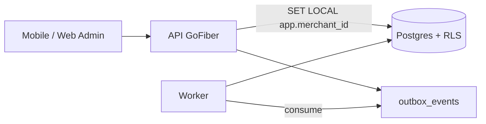

# Backend Architecture — Ringkasan & Tautan

Dokumen ini menjadi **jembatan** antara kode (Go/Fiber/GORM) dan dokumentasi domain. Detail skema & tenant ada di dokumen terpisah agar tidak duplikat.

---

## 1) Stack (repo)

- **Runtime:** Go  
- **HTTP:** GoFiber  
- **ORM:** GORM  
- **Migrasi:** golang-migrate (file SQL di folder `migration/`)  
- **Log:** Zap  
- **DB:** PostgreSQL  

---

## 2) Dokumentasi utama (baca ini dulu)

| Topik | Dokumen |
|-------|---------|
| Konsep tenant, cabang, pricing, billing, offline, merge | [DATABASE_OVERVIEW.md](./DATABASE_OVERVIEW.md) |
| Katalog tabel per domain + nomor migrasi | [DATABASE_SCHEMA_CATALOG.md](./DATABASE_SCHEMA_CATALOG.md) |
| RLS, `SET LOCAL app.merchant_id`, troubleshooting | [TENANT_RLS_DOCUMENTATION.md](./TENANT_RLS_DOCUMENTATION.md) |
| Merger tenant/outlet | [MERGE_TENANT_OUTLET_PLAYBOOK.md](./MERGE_TENANT_OUTLET_PLAYBOOK.md) |
| PRD & NFR produk | [PRD_POS_UMKM.md](./PRD_POS_UMKM.md) |
| Indeks semua dokumen | [README.md](./README.md) |

---

## 3) Prinsip implementasi backend

### 3.1 Multi-tenant

- Setiap request yang mengakses data tenant: buka transaksi DB → `SET LOCAL app.merchant_id = '<uuid>'` → jalankan query.  
- `merchant_id` dari **JWT / session / server-side mapping**, **bukan** dari input client mentah.

### 3.2 GORM + RLS

- Pastikan `SET LOCAL` di **connection / session yang sama** dengan query GORM (biasanya satu `*sql.Tx` per request).  
- Uji: tanpa `SET LOCAL`, query boleh return kosong tanpa error — ini perilaku RLS.

### 3.3 Offline sync & idempotensi

- `client_ops` (dan pola serupa) untuk deduplikasi op dari mobile.  
- Detail alur batch sync & idempotency di PRD / diskusi arsitektur — skema DB sudah mendukung.

### 3.4 Event & worker

- `outbox_events` + worker (konsumsi Redis Streams / Kafka — terserah deployment).  
- Worker harus set `app.merchant_id` per event **atau** pakai role dengan kebijakan BYPASSRLS yang ketat.

### 3.5 Billing & gate fitur

- Gate di **layer aplikasi**: baca `merchant_entitlements` (+ override) + hitung usage (mis. jumlah outlet).  
- Contoh query: `BILLING_SEED_AND_GATE_QUERIES.sql`.

### 3.6 Operasi merge

- Eksekusi merge **bukan** request tenant biasa: gunakan service role / admin dengan bypass RLS yang diaudit.  
- Tabel `merge_*` tidak menggantikan logika bisnis — hanya orchestration + jejak.

---

## 4) Diagram (opsional, tingkat tinggi)

---

*Perluas bagian ini dengan diagram sequence & pseudocode sync ketika modul sync sudah diimplementasi di repo.*
