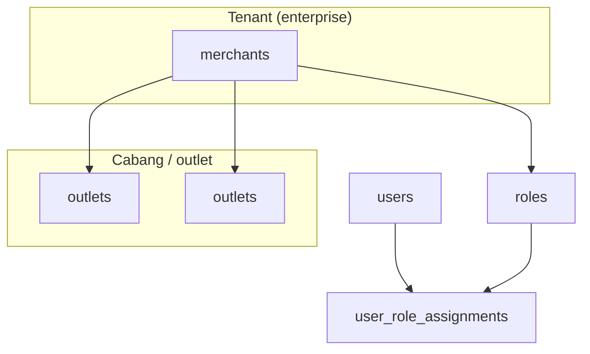
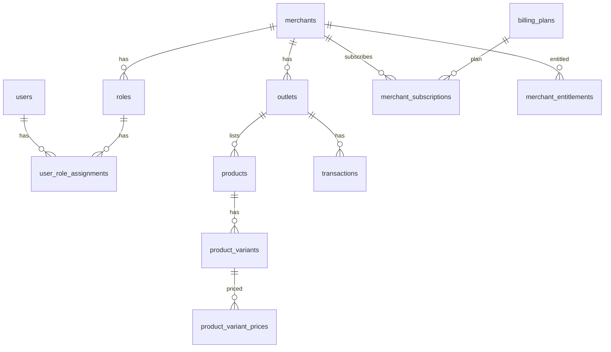

# Database Overview — Konsep & Arsitektur (v2)

Dokumen ini merangkum **makna bisnis** dan **alur data** di balik skema Postgres di folder `migration/`. Detail per tabel ada di [DATABASE_SCHEMA_CATALOG.md](./DATABASE_SCHEMA_CATALOG.md).

**Kebijakan paket (Free/Pro/Enterprise) & diferensiasi produk:** [BUSINESS_TIER_AND_DIFFERENTIATION.md](./BUSINESS_TIER_AND_DIFFERENTIATION.md).

---

## 1) Model multi-tenant

| Konsep | Tabel / field | Penjelasan |
|--------|-----------------|------------|
| **Tenant** | `merchants` | Satu entitas bisnis (induk). Ini “pemilik data” untuk isolasi. |
| **Cabang** | `outlets` + `outlets.merchant_id` | Toko fisik / lokasi kasir. Semua transaksi mengait ke `outlet_id`. |
| **Pemilik rekaman lama** | `outlets.owner_id` → `users` | Menjaga jejak user pembuat; otorisasi utama lewat RBAC. |
| **RBAC** | `roles`, `user_role_assignments` | Peran per merchant (kasir, admin, dll.). |

**Registrasi self-serve (konsep produk):** user membuat akun → sistem membuat **merchant (pusat)** + outlet pusat/default; **bukan** model “user = outlet sembarangan tanpa induk”. Batas cabang/fitur lanjutan dikontrol lewat **billing / entitlements** (lihat §5).

---

## 2) Isolasi data: Row Level Security (RLS)

- Setiap request ke DB yang menyentuh data tenant harus:  
  `SET LOCAL app.merchant_id = '<uuid>'`  
  pada **transaksi yang sama** dengan query.
- `merchant_id` diambil dari **konteks auth** (JWT/session), **bukan** dari body client mentah.

Detail policy, daftar tabel, dan troubleshooting: **[TENANT_RLS_DOCUMENTATION.md](./TENANT_RLS_DOCUMENTATION.md)**.

**Pengecualian penting:**

- **Katalog billing global** (`billing_plans`, `billing_plan_prices`, `billing_plan_features`) — tidak di-scope per merchant di RLS yang sama; dibaca untuk montage harga & fitur.
- **Tabel merge** (`merge_requests`, `merge_checkpoints`, `merge_entity_mappings`) — **tidak** dirancang untuk akses tenant biasa; eksekusi merge butuh **role service / admin** (sering `BYPASSRLS` atau koneksi terpisah). Lihat **[MERGE_TENANT_OUTLET_PLAYBOOK.md](./MERGE_TENANT_OUTLET_PLAYBOOK.md)**.

---

## 3) Pricing: pusat vs cabang

Di `outlets`:

- `price_mode`: `0 = CUSTOM` (harga disimpan per outlet di `product_variant_prices`), `1 = INHERIT_FROM_CENTRAL` (baca harga dari outlet yang ditandai pusat harga).
- `is_price_central`: tepat **satu** outlet per merchant sebagai sumber harga pusat (unique partial index pada `merchant_id`).

**Alur mental:**

1. Tentukan outlet mana `is_price_central = true` (mis. “Toko Pusat”).
2. Cabang dengan `INHERIT_FROM_CENTRAL` tidak perlu duplikasi baris harga jika kebijakan “ikut pusat”.
3. Cabang dengan `CUSTOM` punya baris sendiri di `product_variant_prices` untuk SKU/varian yang sama.

---

## 4) Katalog produk & inventori (enterprise)

- **Produk dasar:** `products`, `categories`, opsional `units`.
- **Varian & harga stok:** `product_variants`, `product_variant_prices`, `product_variant_stocks`.
- **Modifier:** `product_modifiers`, `product_modifier_items`, `transaction_item_modifiers`.
- **Riwayat:** `product_history`.
- **B2B restock:** `suppliers`, `purchase_orders`, `purchase_order_items`.

Semua entitas operasional ini terikat ke outlet/merchant melalui FK + RLS seperti di katalog.

---

## 5) Billing, langganan, dan “buka cabang bayar”

### 5.1 Komponen

| Lapisan | Tabel | Fungsi |
|---------|--------|--------|
| Katalog global | `billing_plans`, `billing_plan_prices`, `billing_plan_features` | Definisi paket (FREE/PRO/…), harga, dan **feature_key** + limit (mis. `outlet_count`). |
| Langganan tenant | `merchant_subscriptions` | Merchant aktif pakai plan mana, periode, status, ID eksternal payment. |
| Override | `merchant_feature_overrides` | Promo/support: override limit/flag per merchant. |
| Invoice & bayar | `billing_invoices`, `billing_invoice_items`, `billing_payments` | Tagihan dan pembayaran. |
| Pemakaian | `billing_usage_daily` | Agregat harian untuk metered / analitik billing. |
| Cache entitlement | `merchant_entitlements` | Snapshot efektif per fitur (untuk gate cepat di API). |

### 5.2 Konsep gate (contoh)

- Fitur **multi-outlet**: bandingkan jumlah `outlets` aktif vs `limit_value` pada entitlement `outlet_count` (lihat contoh SQL di `BILLING_SEED_AND_GATE_QUERIES.sql`).

### 5.3 Alur bisnis (disederhanakan)

1. Merchant baru → subscription (trial/active) ke plan tertentu.
2. Job/worker menghitung `merchant_entitlements` dari plan + override.
3. API **create outlet** cek entitlement sebelum insert.
4. Invoice dibuat saat renewal / pembelian add-on (implementasi app).

---

## 6) Konfigurasi per tenant

Tabel **`merchant_configs`**: key-value per `merchant_id` (JSON, text, atau ciphertext). Konvensi nama key: lihat bagian Merchant Config di **[TENANT_RLS_DOCUMENTATION.md](./TENANT_RLS_DOCUMENTATION.md)**.

---

## 7) POS, pembayaran, dan piutang

- **Transaksi:** `transactions`, `transaction_items`, `payments`.
- **Beban & tagihan:** `expenses`, `tagihan`, `tagihan_payments`.
- **Ringkasan:** `daily_summaries` (aggregat harian per outlet).

---

## 8) Offline-first & eventing

| Tabel | Peran |
|-------|--------|
| `client_ops` | Idempotensi op dari klien (retry aman). |
| `outbox_events` | Outbox pattern ke worker / Redis Streams / Kafka; `merchant_id` untuk scope tenant. |

Alur sync detail (op-log, batch, konflik) dijabarkan di arsitektur backend; prasyarat DB: **id unik client**, **merchant context**, RLS.

---

## 9) Audit & readiness

- **`audit_log`:** jejak aksi penting; opsional konteks HTTP (`method`, `url`, `ip_address`, …). Lihat §10 di [TENANT_RLS_DOCUMENTATION.md](./TENANT_RLS_DOCUMENTATION.md).
- **Readiness di `outlets`:** `last_activity_at`, `last_sync_*`, `onboarding_stage`, `last_device_id`, `last_app_version` — untuk dashboard “siap operasi / sehat tidak”.

---

## 10) Merger (toko gabung / pindah cabang)

Tabel **`merge_requests`**, **`merge_checkpoints`**, **`merge_entity_mappings`** mendukung:

- **Merchant → Merchant:** seluruh bisnis sumber bergabung ke target.
- **Outlet → Merchant:** satu cabang dari tenant A dipindah ke tenant B; cabang lain tidak ikut.

Ini **orchestration + jejak**, bukan logic merge otomatis penuh di SQL — eksekusi dilakukan service dengan urutan checkpoint dan mapping ID. Panduan: **[MERGE_TENANT_OUTLET_PLAYBOOK.md](./MERGE_TENANT_OUTLET_PLAYBOOK.md)**.

---

## 11) Soft delete

Banyak tabel memakai `deleted_at` + `is_deleted` untuk penghapusan logis. Query aplikasi harus memfilter konsisten (atau view) — policy RLS tetap mengacu pada desain per tabel.

---

## 12) Diagram relasi ringkas (ER tingkat tinggi)

---

## 13) Web admin

Skema **mendukung** web admin: user/role per merchant, outlet, billing, audit, config — semua dengan RLS + auth di layer aplikasi. Tidak ada tabel UI terpisah; admin adalah klien API dengan izin lebih tinggi pada **satu atau banyak** `merchant_id` sesuai desain produk.

---

*Terakhir diselaraskan dengan migrasi `000001`–`000085` pada branch `v2`.*
